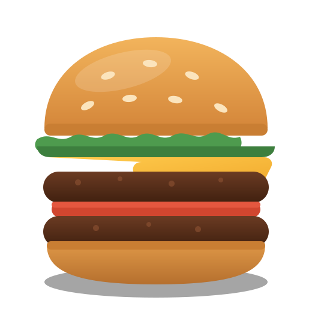

# Ember & Bun — burger restaurant website template

A professional, responsive one-page website template for a burger restaurant, built as
plain HTML, CSS and JavaScript. No build step, no dependencies, no framework — open
`index.html` in a browser and it runs.



## What's included

| Section | Notes |
| --- | --- |
| Top bar | Today's closing time, phone number, address |
| Sticky header | Logo, anchor nav with scroll-spy, mobile drawer, booking CTA |
| Hero | Headline, lede, two CTAs, three proof points, illustrated burger |
| Marquee | Scrolling strip of selling points |
| **Menu** | 17 dishes in 5 categories with live category filtering, prices, dietary tags, allergen note |
| Deal band | Happy-hour offer with before/after pricing |
| Story | Copy plus a four-figure stats row |
| Gallery | Responsive masonry-style grid |
| Testimonials | Three review cards |
| Visit | Address, opening-hours table, perks |
| Booking form | Client-side validated reservation request |
| Footer | Link columns, newsletter sign-up, social links, auto-updating copyright year |

## Files

```
index.html              All markup and content
assets/css/styles.css   All styling — tokens, layout, components, responsive, print
assets/js/main.js       Nav, menu filter, scroll-spy, reveal animations, form validation
assets/img/*.svg        Logo, favicon and food illustrations (vector placeholders)
```

## Running it

Open `index.html` directly, or serve the folder:

```bash
python3 -m http.server 8000   # then visit http://localhost:8000
```

Deploy by uploading the folder to any static host — GitHub Pages, Netlify, Vercel,
Cloudflare Pages or plain shared hosting.

## Customising

### Brand colours

Every colour comes from six custom properties at the top of `assets/css/styles.css`.
Change these and the whole site follows:

```css
:root {
  --ink:    #141210;  /* page background */
  --ink-2:  #1e1a17;  /* cards and raised surfaces */
  --ink-3:  #2a2421;  /* borders */
  --cream:  #f7f1e8;  /* light text and surfaces */
  --amber:  #f0a72c;  /* primary accent — buttons, prices, links */
  --tomato: #d1462f;  /* secondary accent — badges */
}
```

Spacing, radii, shadows, container width and the two font stacks are tokens in the same
block.

### Fonts

The template loads **Bebas Neue** (headings) and **Inter** (body) from Google Fonts in
`index.html`. Swap the `<link>` and the `--font-display` / `--font-body` tokens to use
your own. Both tokens carry system fallbacks, so the page still looks right if the
webfont fails to load.

### Menu items

Each dish is one `<li class="card">` in `#menuGrid`. Copy a block and edit it:

```html
<li class="card" data-category="burgers">
  <div class="card__media"></div>
  <div class="card__body">
    <div class="card__head">
      <h3 class="card__title">Dish name <span class="card__flag">Best seller</span></h3>
      <p class="card__price">$16</p>
    </div>
    <p class="card__desc">Short description of what's in it.</p>
    <ul class="tags"><li class="tag">Spicy</li></ul>
  </div>
</li>
```

- `data-category` must match a `data-filter` value on one of the filter buttons:
  `burgers`, `smash`, `sides`, `drinks`, `sweets`.
- To add a category, add one `<button class="chip" data-filter="yourkey">` to
  `.menu-filters` and use `data-category="yourkey"` on the dishes. The JavaScript picks
  it up automatically — no code changes needed.
- `card__flag` is the small pill next to the title; add `card__flag--green` for a green
  one (used for "Vegan").

### Photos

The illustrations in `assets/img/` are SVG placeholders so the template ships without
binary assets. Replace them with real photography — the markup already sets `width`,
`height` and `loading="lazy"`, so just point the `src` at your images and keep the
dimensions proportional. If you use photos, also replace the `og:image` meta tag with a
JPEG or PNG: most social networks do not render SVG previews.

### Wiring up the booking form

The form validates in the browser and then shows a confirmation without sending
anything. Replace the marked block in `assets/js/main.js` with a real request:

```js
fetch('/api/reservations', {
  method: 'POST',
  headers: { 'Content-Type': 'application/json' },
  body: JSON.stringify(Object.fromEntries(new FormData(form)))
});
```

The same applies to the newsletter form in the footer.

### Real business details

Search `index.html` for these and replace them:

- The name "Ember & Bun", the tagline and all body copy
- Phone `(555) 014-2` / `tel:+15550142`, email, and the Kiln Street address
- The opening-hours table and the top-bar closing time
- The `application/ld+json` block near the top of `<head>` — this is
  [schema.org Restaurant](https://schema.org/Restaurant) data that search engines use for
  rich results, so keep it in sync with the visible hours and address
- `<link rel="canonical">` and the Open Graph tags
- The `#` placeholders on the social and legal links

## Accessibility

- Skip link, landmark elements and a single `<h1>`
- Visible focus rings on every interactive element
- The filter toolbar exposes state with `aria-pressed` and supports arrow-key navigation
- Form errors are tied to their fields with `aria-invalid` and announced through
  `role="status"`
- Colour pairings meet WCAG AA contrast on both the dark and amber surfaces
- All motion — the floating hero, the marquee, the scroll reveals — is disabled under
  `prefers-reduced-motion: reduce`

## Progressive enhancement

With JavaScript disabled the full menu stays visible (nothing is hidden by default),
all anchors work, and the form falls back to native browser validation.

## Browser support

Any current version of Chrome, Edge, Firefox or Safari. Uses CSS custom properties,
grid, `clamp()` and `IntersectionObserver`, all of which have feature-detection or
graceful fallbacks in `main.js`.

## Printing

`Ctrl/Cmd + P` produces a clean two-column menu sheet: navigation, hero art, gallery,
forms and footer are hidden, and the type switches to black on white. Handy for
in-house menus.
